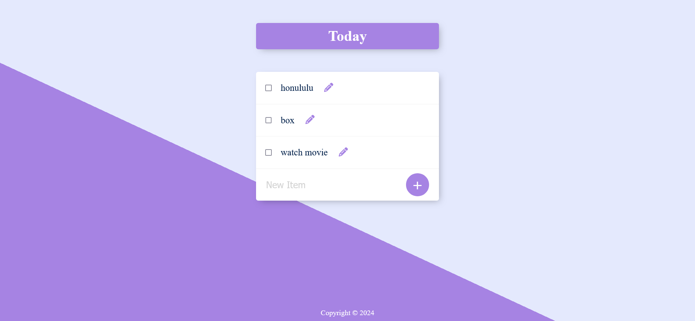

# Permalist Project


## Overview

The Permalist Project is a simple to-do list application built using Node.js, Express, PostgreSQL, and EJS templating. Users can add, edit, and delete items from their to-do list. The application uses a PostgreSQL database to store the list items.

## Features

- Add new items to the to-do list.
- Edit existing items.
- Delete items from the list.
- Display the list of items in a user-friendly interface.

## Prerequisites

- Node.js (v14 or higher)
- PostgreSQL
- npm (Node Package Manager)

## Installation

1. **Clone the repository**:
    ```sh
    git clone https://github.com/yourusername/permalist-project.git
    cd permalist-project
    ```

2. **Install dependencies**:
    ```sh
    npm install
    ```

3. **Set up PostgreSQL database**:
    - Create a PostgreSQL database named [`permalist`](command:_github.copilot.openSymbolFromReferences?%5B%22%22%2C%5B%7B%22uri%22%3A%7B%22scheme%22%3A%22file%22%2C%22authority%22%3A%22%22%2C%22path%22%3A%22%2Fe%3A%2Fwork%2FLearningBackend%2Flearning_Postgrace%2FPermalist%2BProject%2F8.6%20Permalist%20Project%2Findex.js%22%2C%22query%22%3A%22%22%2C%22fragment%22%3A%22%22%7D%2C%22pos%22%3A%7B%22line%22%3A10%2C%22character%22%3A13%7D%7D%5D%2C%22d606d643-08ff-4a42-90d3-473b6d916f0d%22%5D "Go to definition").
    - Create a table named [`items`](command:_github.copilot.openSymbolFromReferences?%5B%22%22%2C%5B%7B%22uri%22%3A%7B%22scheme%22%3A%22file%22%2C%22authority%22%3A%22%22%2C%22path%22%3A%22%2Fe%3A%2Fwork%2FLearningBackend%2Flearning_Postgrace%2FPermalist%2BProject%2F8.6%20Permalist%20Project%2Findex.js%22%2C%22query%22%3A%22%22%2C%22fragment%22%3A%22%22%7D%2C%22pos%22%3A%7B%22line%22%3A21%2C%22character%22%3A4%7D%7D%5D%2C%22d606d643-08ff-4a42-90d3-473b6d916f0d%22%5D "Go to definition") with the following schema:
        ```sql
        CREATE TABLE items (
            id SERIAL PRIMARY KEY,
            title VARCHAR(255) NOT NULL
        );
        ```

4. **Configure database connection**:
    - Update the database connection details in 

index.js

 if necessary:
        ```javascript
        const db = new pg.Client({
          user: "postgres",
          host: "localhost",
          database: "permalist",
          password: "0000",
          port: 5432,
        });
        ```

## Usage

1. **Start the server**:
    ```sh
    nodemon index.js
    ```

2. **Open your browser** and navigate to `http://localhost:3000`.

## Project Structure

- 

index.js

: Main server file that handles routes and database interactions.
- `views/`: Directory containing EJS templates for rendering the UI.
  - 

index.ejs

: Main template for displaying the to-do list.
  - `partials/`: Directory containing partial templates like header and footer.
- `public/`: Directory for static assets like CSS and images.

## Routes

- `GET /`: Fetch and display all items from the database.
- `POST /add`: Add a new item to the database.
- `POST /edit`: Edit an existing item in the database.
- `POST /delete`: Delete an item from the database.

## Example

### Adding a New Item

1. Enter the item title in the input field.
2. Click the "+" button to add the item to the list.

### Editing an Item

1. Click the pencil icon next to the item you want to edit.
2. Enter the new title in the input field that appears.
3. Click the check icon to save the changes.

### Deleting an Item

1. Check the checkbox next to the item you want to delete.
2. The item will be removed from the list.

## License

This project is licensed under the MIT License. See the LICENSE file for details.

## Acknowledgements

- [Express](https://expressjs.com/)
- [EJS](https://ejs.co/)
- [PostgreSQL](https://www.postgresql.org/)

---

Feel free to customize this README file according to your project's specific details and requirements.
